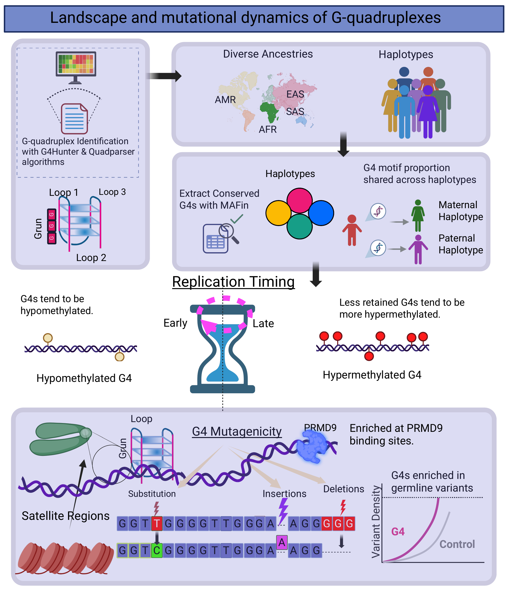

# Landscape and mutational dynamics of G-quadruplexes across the complete human genome

Code and analysis notebooks accompanying the manuscript *"Landscape and mutational dynamics of G-quadruplexes across the complete human genome"*.

## About

G-quadruplexes (G4s) are alternative, non-B DNA structures that had long been difficult to study in repeat-rich regions of the genome due to the limitations of short-read sequencing. This repository contains the analysis code used to map and characterize potential G4-forming sequences across the gap-free T2T-CHM13 reference genome and across 88 haplotypes from the Human Pangenome Reference Consortium (HPRC), spanning diverse ancestries.

Using this pipeline, we show that G4s are strongly enriched in specific repetitive elements — including particular centromeric/pericentromeric satellite families and ribosomal DNA arrays — and experimentally validate the most prevalent predicted structures. Genome-wide, G4 loci tend to be hypomethylated relative to background and are disproportionately affected by insertions and deletions, indicating elevated genomic instability. We further find that G4s are consistently enriched at PRDM9 binding sites, a key determinant of meiotic recombination hotspots. Together, these results position G4s as dynamic, functionally relevant genomic elements with implications for genome evolution and disease.

## License

This code is released under the [MIT License](LICENSE), an [OSI-approved](https://opensource.org/licenses/MIT) open source license.

## Contact

nicolechantzi@gmail.com
